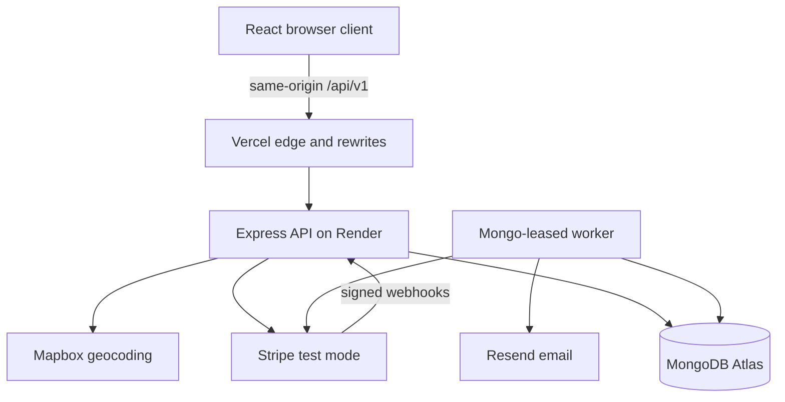
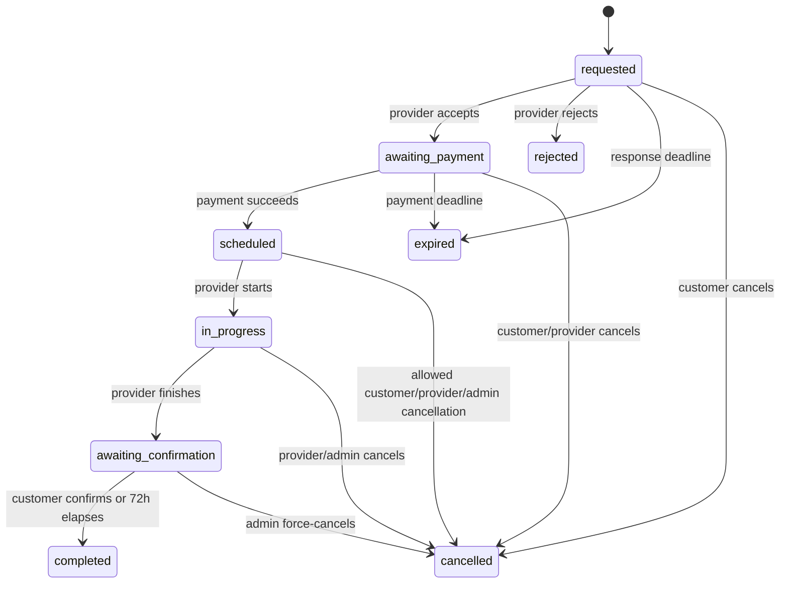

# LocalServe — Software Architecture

**Version:** 2.0
**Status:** Approved source of truth
**Last updated:** 5 September 2026
**Companion document:** `docs/localserve-spec.md` v2.0

---

## 1. Authority and Scope

This document defines **how LocalServe must be built**. The product specification defines what it must do. Together they are the implementation source of truth. A change that alters a requirement, domain invariant, API contract, security boundary, or deployment assumption must update the relevant document before implementation.

LocalServe is a portfolio demonstration, not a production business. The architecture deliberately demonstrates sound marketplace engineering while avoiding operational infrastructure that adds little portfolio value.

## 2. Architectural Decisions

| ID | Decision | Rationale |
|---|---|---|
| ADR-01 | Use a TypeScript modular monolith: React client, Express API, MongoDB. | Fits the existing repository and keeps domain boundaries visible without microservice overhead. |
| ADR-02 | One account is always customer-capable; an approved provider profile adds provider capability. | Matches the agreed dual-role model and avoids duplicate identities. |
| ADR-03 | Use fixed-price, duration-based services only. | Makes totals and availability deterministic. |
| ADR-04 | Use request-based scheduling with a database-enforced reservation lock. | Providers control acceptance while concurrent requests cannot double-book a confirmed slot. |
| ADR-05 | Keep booking, payment, transfer, and dispute states separate. | Prevents one overloaded status field and makes recovery explicit. |
| ADR-06 | Use Stripe Connect Express in test mode with separate charges and transfers. | Demonstrates marketplace payment orchestration and delayed transfer without claiming escrow. |
| ADR-07 | Use a transactional outbox and a leased MongoDB worker; do not add Redis. | Provides reliable asynchronous processing with the existing stack. |
| ADR-08 | Expose a same-origin versioned API at `/api/v1`. | Avoids third-party-cookie fragility and permits future contract evolution. |
| ADR-09 | Store money as integer USD cents and commission as basis points. | Avoids floating-point money errors. |
| ADR-10 | Expose approximate locations publicly and exact service addresses only after payment. | Applies least-privilege privacy to marketplace discovery. |
| ADR-11 | Use Mapbox behind a server-side geocoding adapter. | Provides manual place search without exposing a privileged token or coupling domain logic to a vendor. |
| ADR-12 | Deploy the client on Vercel and API/worker on Render free services for demonstration only. | Matches the portfolio constraint; cold starts and no SLA are accepted. |
| ADR-13 | Use a 3-hour minimum lead, 90-day booking horizon, 24-hour response cap, provider-local weekly availability with date overrides, and no self-booking. | Makes every scheduling decision deterministic while preserving the dual-capability account model. |
| ADR-14 | Permit customer disputes for 24 hours after completion. | Makes the documented refund-after-transfer and proportional reversal path reachable in the portfolio demonstration. |

## 3. Technology Baseline

The implementation must remain on compatible releases of the currently selected major versions unless an ADR changes them.

| Layer | Baseline |
|---|---|
| Runtime | Node.js 22.12+; TypeScript 6 |
| Client | React 19, Vite 8, React Router 7, TanStack Query 5, Zustand 5, React Hook Form 7, Zod 4, Tailwind CSS 4, Axios 1 |
| API | Express 5, Mongoose 9, Zod 4 |
| Integrations | Stripe Node 22, Resend 6, Mapbox HTTP APIs |
| Data | MongoDB Atlas replica set |
| Quality | ESLint, Vitest, React Testing Library, Supertest, Playwright |

The repository must commit lockfiles. Dependency upgrades must pass builds, lint, unit, integration, and end-to-end tests.

## 4. System Context and Containers



| Container | Responsibility |
|---|---|
| React client | Routing, accessible UI, form validation, server-state caching, session-aware presentation. It never decides authorization, price, eligibility, or state transitions. |
| Express API | Authentication, authorization, validation, domain commands, queries, Stripe webhooks, serialization, and transactional writes. |
| Worker | Claims outbox jobs with leases; sends email; expires requests; auto-completes bookings; reconciles payments; creates eligible transfers. |
| MongoDB | System of record, geospatial queries, unique constraints, transactions, outbox, audit events, and scheduling locks. |
| External adapters | Stripe test payments, Mapbox geocoding, and Resend email. Domain services depend on local interfaces, not vendor SDK types. |

## 5. Repository and Module Boundaries

The existing `client/` and `server/` split is retained. New server code should be organized by domain rather than by generic technical folders.

```text
client/src/
  app/                 composition, router, providers
  features/            auth, discovery, provider, booking, payment, admin
  shared/              UI primitives, API client, schemas, utilities

server/src/
  app/                 Express composition and middleware
  modules/             auth, users, providers, services, discovery,
                       bookings, payments, disputes, reviews, admin
  infrastructure/      database, stripe, geocoding, email, outbox, logging
  shared/              errors, security, validation, types
  worker/              schedulers and outbox consumers
```

Each server module owns its routes, application services, domain rules, repository interfaces, schemas, and serializers. Routes must be thin. Mongoose documents and secrets must never be returned directly to the client. Cross-module writes go through application services and MongoDB transactions.

## 6. Domain Data Model

All records use UTC timestamps, MongoDB ObjectIds internally, `createdAt`, and `updatedAt`. API IDs are strings. Soft-deletable public resources have `deletedAt`; financial and audit records are never hard-deleted.

### 6.1 Core collections

| Collection | Required fields and constraints |
|---|---|
| `users` | normalized unique email, password hash, email-verification state, `isAdmin`, status `active | suspended`, public name, optional phone; no role enum for customer/provider capability. |
| `refresh_sessions` | user, SHA-256 token hash, token family, expiry, last-used time, revoked time, replacement link, client metadata. TTL index on expiry. |
| `provider_profiles` | unique user, approval state/reason/timestamps, bio, public general-area label, exact GeoJSON service origin, radius, `acceptingNewBookings`, IANA time zone, weekly availability, date overrides, rating aggregate, Connect account state. `2dsphere` index on origin. |
| `categories` | unique slug, display name, sort order, active flag. |
| `subcategories` | parent category, unique slug within parent, display name, sort order, active flag. A service subcategory must belong to its category. |
| `services` | provider profile, title, description, category and subcategory references, price cents, currency `usd`, duration minutes, active flag. Price positive; duration 30–480 in 15-minute increments. |
| `bookings` | parties, service reference, immutable service/provider/customer/location snapshots, requested interval, booking state, response/payment/confirmation/completion deadlines, payment/transfer/dispute summaries, optimistic version. |
| `schedule_locks` | participant user ID, UTC 15-minute bucket, booking reference, and informational booking role (`provider` or `customer`). A unique compound index on participant user ID and bucket is the final overlap guard; role is deliberately excluded so one dual-capability account cannot provide and receive overlapping services. |
| `payments` | unique booking, Stripe PaymentIntent/charge IDs, amount/currency, status, idempotency keys, last error. |
| `transfers` | booking/payment, Stripe transfer ID, gross, commission, provider amount, released amount, reversed amount, status, release eligibility and timestamps. |
| `refunds` | booking/payment, Stripe refund ID, amount, reason, status, transfer-reversal state. |
| `disputes` | booking, opener, reason, evidence text, state, source booking state, admin resolution, refund/reversal references, timestamps. A partial unique index permits at most one `open` or `under_review` dispute per booking. |
| `reviews` | unique booking and reviewer, provider, rating 1–5, required text, provider response, moderation state. Only completed paid bookings with no active dispute qualify. |
| `webhook_events` | unique Stripe event ID, type, payload metadata, received/processed/error timestamps. |
| `outbox_events` | aggregate, event type/version, payload, availability, lease owner/expiry, attempts, completion, last error. |
| `audit_events` | actor, action, target, safe before/after summary, request/correlation ID, timestamp. Append-only. |

### 6.2 Snapshot rule

A booking must retain immutable snapshots of service title, price, currency, duration, commission rate, calculated fee/provider amounts, provider display identity, customer display identity, exact service address, coordinates, and agreed start/end. Later profile, availability, or service edits must not alter an existing booking.

Personally identifying fields must be excluded from ordinary logs and audit diffs. Passwords, raw refresh tokens, Stripe secrets, webhook secrets, and full webhook payloads must never be logged.

Weekly availability is embedded in the provider profile because it is small and updated as one aggregate. Date overrides are limited to dates inside the 90-day booking horizon; expired overrides may be pruned. Category and subcategory references remain on services and are snapshotted onto bookings; provider profiles do not duplicate category membership.

## 7. State Machines and Concurrency

### 7.1 Booking state



Terminal booking states are `completed`, `rejected`, `cancelled`, and `expired`. A dispute is an orthogonal record and flag, not a booking status. It can be opened for a `scheduled` provider no-show when `now >= scheduledStart + 30 minutes`, from `in_progress` or `awaiting_confirmation`, or after completion while `now < completedAt + 24 hours`. An active dispute freezes auto-completion and unreleased transfers. A post-completion dispute never reopens the booking lifecycle.

An administrator may force-cancel a nonterminal booking for a documented moderation or support reason only when no dispute is active. The transaction changes the booking to `cancelled`, releases its schedule locks, records the audit/outbox events, and queues one idempotent full refund if payment succeeded. An active dispute must be concluded through the dispute-resolution command.

Every transition must:

1. check actor permission and current version/state;
2. validate time and payment prerequisites;
3. write state, deadlines, audit event, and outbox event in one transaction;
4. return the canonical serialized booking.

Illegal or stale transitions return `409 CONFLICT`.

### 7.2 Time policy and provider availability

The scheduling constants are normative, not environment-tunable: minimum lead `180` minutes, maximum horizon `90` days, response cap `24` hours, payment cutoff `120` minutes before start, provider start window `[scheduledStart - 30 minutes, scheduledStart + 30 minutes)`, confirmation period `72` hours, no-show grace `30` minutes, and post-completion dispute window `24` hours. Starting is forbidden at the upper start-window boundary, exactly when no-show eligibility begins.

Weekly availability is stored as local wall-clock `[start, end)` windows for weekdays `0–6` in the provider's valid IANA time zone. Boundaries use 15-minute increments, windows do not overlap, and an overnight window is split at midnight. A date override for `YYYY-MM-DD` in the provider's time zone replaces, rather than merges with, that date's weekly windows; it is either closed or contains custom validated windows. UTC booking instants are converted into the provider's time zone for containment, so daylight-saving changes are handled by a time-zone-aware library rather than fixed offsets. The entire booking interval must fit inside one effective window.

At request creation, the start must be on a 15-minute UTC boundary and satisfy `now + 180 minutes <= start <= now + 90 days`. The server stores `responseDeadline = min(createdAt + 24 hours, start - 120 minutes)`. At acceptance it revalidates the service, profile approval, account status, `acceptingNewBookings`, effective availability, self-booking prohibition, start/end, response deadline, and the provider's Stripe test-payout readiness. Availability edits never invalidate an already accepted booking. All deadlines use the same rule: the guarded command is valid only while `now < deadline`, and the deadline has elapsed when `now >= deadline`. Expected-state transactional writes resolve races between a command and its deadline worker.

### 7.3 Overlap prevention

Discovery availability is advisory. Acceptance is authoritative:

1. Calculate `[start, end)` from the immutable service-duration snapshot.
2. Expand the half-open interval into UTC 15-minute buckets.
3. In one MongoDB transaction, insert locks for every bucket under the provider account's user ID and the customer account's user ID, move the booking to `awaiting_payment`, and persist `paymentDeadline = min(acceptedAt + 24 hours, start - 120 minutes)`.
4. A duplicate-key failure for either party aborts the transaction and returns `409 SLOT_UNAVAILABLE`.
5. Delete locks when a booking becomes `rejected`, `cancelled`, `expired`, or `completed`. Booking snapshots and audit events provide history; lock records are not history.

The unique user/bucket lock constraint, not an application-only overlap query, prevents concurrent double acceptance. Because the same key space is used for both roles, a dual-capability user cannot accept provider work that overlaps a booking they made as a customer, or vice versa. Worker operations and command endpoints must be idempotent.

### 7.4 Independent financial and dispute states

Payment: `unpaid | processing | succeeded | failed | partially_refunded | refunded`.

Transfer: `not_eligible | pending_release | released | partially_reversed | reversed | failed`.

Dispute: `open | under_review | resolved_customer | resolved_provider | withdrawn`.

The booking projection may copy these values for efficient reads, but the payment, transfer, refund, and dispute collections remain authoritative.

### 7.5 Dispute workflow

`open` and `under_review` are active states. The customer may withdraw only an `open` dispute; an administrator moves `open` to `under_review` and resolves from either active state. Withdrawal removes the freeze without changing booking state. If the original confirmation deadline has elapsed, the worker may auto-complete on its next pass.

An administrator resolution records `resolvedBy`, `resolvedAt`, a required note, refund amount, whether the service was delivered, and resulting payment/transfer references. Customer resolution with a full refund and `serviceDelivered=false` changes a nonterminal booking to `cancelled`. Any partial-refund delivered-service resolution changes a nonterminal booking to `completed`; an already completed booking remains completed. Provider resolution uses no refund, changes a nonterminal booking to `completed`, and makes any remaining transfer eligible. State and financial writes plus audit/outbox events occur in one transaction before external Stripe work.

## 8. HTTP API Contract

All endpoints are under `/api/v1`; JSON uses `camelCase`; dates are ISO 8601 UTC; money fields end in `Cents`. Collection reads use cursor pagination with a default page size of 20 and maximum of 50. Mutating commands accept an `Idempotency-Key` where retries could duplicate financial or state-changing effects.

### 8.1 Endpoint surface

| Area | Endpoints |
|---|---|
| Auth | `POST /auth/register`, `/auth/login`, `/auth/refresh`, `/auth/logout`, `/auth/logout-all`, `/auth/verify-email`, `/auth/resend-verification`, `/auth/forgot-password`, `/auth/reset-password`; `GET /auth/me` |
| Providers | `POST /provider-profile`, `/provider-profile/submit`; `GET/PATCH /provider-profile`; `GET /providers`, `/providers/:id` |
| Services | `POST /services`; `GET /services/:id`; `PATCH /services/:id`; `DELETE /services/:id` (soft deactivation); `POST /services/:id/activate`; `GET /providers/:id/services` |
| Taxonomy and location | `GET /categories`, `/categories/:id/subcategories`, `/locations/search?q=...` |
| Discovery | `GET /discovery/providers?lat&lng&radiusKm&categoryId&subcategoryId&minPriceCents&maxPriceCents&minRating&sort&cursor&limit` |
| Bookings | `POST /bookings`; `GET /bookings`, `/bookings/:id`; command endpoints below |
| Payments | `POST /bookings/:id/payment-intent`; `GET /bookings/:id/payment`; `POST /stripe/connect/account-link`; `GET /stripe/connect/status` |
| Disputes | `POST /bookings/:id/disputes`; `GET /bookings/:id/dispute`; `POST /bookings/:id/dispute/withdraw` |
| Reviews | `POST /bookings/:id/review`; `GET /providers/:id/reviews`; `PUT /reviews/:id/response` |
| Admin reads | `GET /admin/users`, `/admin/provider-profiles`, `/admin/services`, `/admin/bookings`, `/admin/payments`, `/admin/transfers`, `/admin/disputes`, `/admin/reviews`, `/admin/categories` |
| Admin commands | User suspend/reactivate, profile approve/reject, service hide/restore, booking force-cancel, dispute review/resolve, review hide/restore, and category/subcategory create/update/activate/deactivate endpoints described below |
| Platform | `POST /webhooks/stripe`; `GET /health/live`, `/health/ready` |

Booking commands use `POST /bookings/:id/{accept|reject|cancel|start|finish|confirm}`. Admin commands use `POST /admin/users/:id/{suspend|reactivate}`, `/admin/provider-profiles/:id/{approve|reject}`, `/admin/services/:id/{hide|restore}`, `/admin/bookings/:id/force-cancel`, `/admin/disputes/:id/{review|resolve}`, and `/admin/reviews/:id/{hide|restore}`. Category and subcategory administration uses ordinary create and explicit update/activate/deactivate endpoints under `/admin/categories` and `/admin/subcategories`. Commands are explicit because they carry domain rules and audit semantics; generic status patching and unrestricted refund endpoints are forbidden.

Discovery `sort` is one of `distance`, `rating`, `price_asc`, or `newest`; the default is `distance`. Cursors encode the selected sort key plus a stable ID tie-breaker. Repeated `DELETE /services/:id` and other idempotent state-setting commands return the canonical current state rather than duplicating effects.

### 8.2 Response and error envelope

Successful responses contain `{ "data": ... }`; list responses also contain `{ "page": { "nextCursor": ... } }`. Errors use:

```json
{
  "error": {
    "code": "SLOT_UNAVAILABLE",
    "message": "The requested time is no longer available.",
    "fieldErrors": {},
    "requestId": "..."
  }
}
```

Expected status codes are `400` malformed request, `401` unauthenticated, `403` forbidden, `404` hidden/not found, `409` state or uniqueness conflict, `422` valid shape but failed domain rule, `429` rate limited, and `500` unexpected error. Production-like responses expose no stack traces.

## 9. Authentication, Sessions, and CSRF

- Passwords are hashed with Argon2id using reviewed parameters; login and recovery routes are rate limited.
- Login is allowed only after email verification; resend-verification remains available without an authenticated session and is rate limited.
- Access tokens are short-lived (15 minutes) and held in client memory only.
- Refresh tokens are 256-bit opaque random values in an `HttpOnly`, `Secure`, `SameSite=Strict`, path-scoped cookie.
- Only a SHA-256 refresh-token hash is stored. Refresh rotates the token atomically; reuse revokes the entire family.
- Logout revokes the current session; password reset and account suspension revoke all sessions.
- Cookie-authenticated mutation routes validate an origin allowlist and a CSRF token. Stripe webhook routes use the raw body and Stripe signature instead.
- The Vercel client calls relative `/api/v1`; rewrites proxy to Render. Local Vite development uses the same relative path through its proxy.

This same-origin design is required. A browser configured to call a separate Render origin directly is not a supported deployment.

## 10. Authorization

Authorization is enforced in application services, never inferred from UI visibility.

| Resource/action | Rule |
|---|---|
| Public discovery | Only approved, unsuspended providers with `acceptingNewBookings=true` and active services; general-area label and calculated distance only. |
| Provider editing | The profile owner; material edits reset approval to `pending`. |
| Service management | Profile owner with a provider profile; only approved profiles are publicly visible. |
| Booking read | Customer, booked provider, or admin. |
| Booking create | Authenticated customer; the selected service must not belong to that customer's provider profile. |
| Accept/reject/start/finish | Booked provider with state/time prerequisites. Acceptance also requires approved profile, `acceptingNewBookings=true`, effective availability, and payout-capable test Connect account. |
| Pay/confirm/customer cancel/review | Booked customer with state/time prerequisites; review additionally requires no active dispute. |
| Customer service address and booking-party contact | Booking parties and admin, only after successful payment except the customer may always see data they supplied. A provider's private origin/address is never disclosed to the other party. |
| Approval/dispute resolution/suspension | Admin only; audit required. |

Suspension removes a provider from discovery, revokes sessions, and blocks every protected action, including acceptance and fulfillment. It does not erase existing bookings or financial records; administrators must resolve affected paid bookings through the documented cancellation or dispute path.

## 11. Geospatial Search and Privacy

Provider origins and booking coordinates use GeoJSON longitude-first order: `[longitude, latitude]`, WGS84. The discovery repository uses `$geoNear`/`$nearSphere`, bounded radius, indexed filters, deterministic secondary sorting, and cursor pagination.

The browser may request geolocation only after user action. Manual search sends text to `GET /api/v1/locations/search`; the server-side Mapbox adapter returns a constrained set of place labels and coordinates. Tokens are restricted by scope and environment.

Creating a booking requires a normalized service address and coordinates. The server recomputes the spherical distance to the provider snapshot origin and rejects a location outside the service radius. Client-supplied distance is never trusted.

Public DTOs contain only the provider's general-area label and calculated distance, never exact, rounded, or coarsened provider coordinates. Pre-payment booking DTOs hide provider direct contact and the other party's exact address. Post-payment party DTOs disclose only what is necessary to perform the service.

## 12. Stripe Test-Mode Architecture

### 12.1 Connect onboarding

Providers receive a Stripe Express connected account in test mode. The API creates single-use account links and reads capability/account state from Stripe; the client does not assert onboarding completion. Provider acceptance requires charges/transfers readiness needed by the selected test flow.

### 12.2 Charge and delayed transfer

1. Provider accepts; the server calculates the payment deadline as the earlier of 24 hours after acceptance and 2 hours before start.
2. Customer requests a PaymentIntent. The server derives amount from the immutable booking snapshot and uses a deterministic Stripe idempotency key.
3. Stripe.js confirms payment with test credentials.
4. A signed webhook, not the browser redirect, marks payment succeeded and booking scheduled.
5. After completion and with no active dispute, the worker creates a separate transfer to the connected account.

For `grossAmountCents = G` and `commissionBps = 1000`:

```text
platformFeeCents = floor((G * 1000 + 5000) / 10000)
providerAmountCents = G - platformFeeCents
```

The exact algorithm and 10% rate are stored on the booking. No endpoint or copy may call this escrow.

### 12.3 Webhook processing

The webhook handler must preserve the raw request body, verify the signing secret, insert the Stripe event ID under a unique constraint, enqueue processing, and return quickly. Duplicate delivery is successful no-op behavior. Event handlers fetch canonical Stripe objects when ordering or completeness is uncertain and only advance valid states. A verified late payment success for a `cancelled` or `expired` booking queues one full refund and never reopens the booking.

Relevant event families include PaymentIntent success/failure, refunds, account updates, transfers, and reversals. A reconciliation worker periodically checks nonterminal local payments/transfers against Stripe test mode.

### 12.4 Refunds and reversals

Eligible cancellation creates a full Stripe refund. A dispute resolution may create a full or partial refund, and cumulative successful refunds must never exceed the original charge.

For cumulative successful refunds of `R`, derive the cumulative allocation target:

```text
cumulativeCommissionReductionCents = floor((R * commissionBps + 5000) / 10000)
cumulativeProviderRecoveryCents = R - cumulativeCommissionReductionCents
currentCommissionReductionCents = cumulativeCommissionReductionCents - priorCommissionReductionCents
currentProviderRecoveryCents = cumulativeProviderRecoveryCents - priorProviderRecoveryCents
```

`R` must never exceed the original gross charge. Computing each current delta from cumulative targets prevents cent-level rounding drift across multiple partial refunds. If no transfer exists, release is permanently blocked or reduced to the remaining provider entitlement. If a transfer was released, the worker requests a reversal up to `currentProviderRecoveryCents`, bounded by the unreversed transferred amount. A partial recovery changes transfer state to `partially_reversed`; complete recovery changes it to `reversed`. Refund and reversal attempts, errors, Stripe references, and idempotency keys are recorded independently. A post-completion dispute leaves the booking `completed` while its financial and dispute records show the adjustment.

## 13. Background Processing and Outbox

Domain transactions write outbox events with business state. A separate worker claims available events using atomic `findOneAndUpdate`, a unique worker ID, and a lease expiry. Handlers must tolerate at-least-once delivery and persist external idempotency keys.

Required scheduled jobs:

- expire `requested` bookings at `min(createdAt + 24 hours, scheduledStart - 2 hours)`;
- expire unpaid accepted bookings at `min(acceptedAt + 24 hours, scheduledStart - 2 hours)` and release both parties' locks;
- auto-complete 72 hours after provider finish when no dispute is active;
- create eligible Stripe test transfers;
- create refunds for late payment success on cancelled/expired bookings;
- execute proportional transfer reversals required by dispute refunds;
- retry email and external operations with capped exponential backoff and jitter;
- reconcile stuck payment and transfer records;
- recover abandoned leases and flag exhausted jobs for admin inspection.

No keep-alive ping may be used to defeat free-host sleeping. Jobs resume safely after cold starts because deadlines and leases are persisted.

## 14. Email and Files

Resend is accessed through an email adapter. Emails are generated from versioned templates and triggered from the outbox for verification, password reset, provider-profile approval/rejection, booking request/accept/reject, payment success, cancellation, service completion, dispute updates, refund, and transfer-release events. Delivery failure must not roll back committed business state. The MVP has no in-app notification collection or real-time notification transport.

User-uploaded media is not required for MVP completion. Seeded profiles may reference repository-owned static assets or fixed HTTPS demo assets. There is no MVP upload endpoint and the API never stores image bytes in MongoDB. Adding user uploads or arbitrary remote image URLs requires an explicit architecture revision covering storage, validation, authorization, and deletion.

## 15. Express and Security Pipeline

Middleware order is normative:

1. trusted-proxy and request/correlation ID;
2. structured access logging with redaction;
3. security headers and strict CORS/origin policy;
4. Stripe webhook raw-body route;
5. bounded JSON and form parsers;
6. cookie parsing and CSRF/origin checks;
7. global and sensitive-route rate limits;
8. authentication and route handlers;
9. not-found and centralized error handling.

Validation schemas reject unknown sensitive fields. Mongo query objects are built from allowlisted values; user input is never spread into a query or update. Updates use explicit `$set` fields and validators. Helmet headers, CSP compatible with Stripe, TLS, secret separation, dependency scanning, and OWASP-aligned tests are required.

## 16. Errors, Logging, Health, and Metrics

Logs are structured JSON containing timestamp, level, service, environment, request ID, route template, status, latency, safe user/booking IDs, event name, and error code. They exclude authorization headers, cookies, tokens, passwords, exact addresses, and payment method details.

`/health/live` reports process liveness without dependency calls. `/health/ready` checks MongoDB and critical configuration with a short timeout. Neither returns secrets or detailed topology.

At minimum track request/error latency, authentication failures, booking transition failures, outbox depth/age/retries, webhook failures, payment/transfer reconciliation mismatches, and email failures. For a portfolio deployment, provider dashboards may supply infrastructure metrics; domain metrics remain structured application events.

## 17. Frontend Architecture

- TanStack Query owns server state; Zustand holds only ephemeral client state such as session presentation and filters. Server entities must not be duplicated as long-lived Zustand stores.
- A single typed API client uses relative `/api/v1`, attaches the access token, performs one coordinated refresh attempt on `401`, and never loops refreshes.
- Route loaders/guards improve navigation but are not security boundaries.
- Zod schemas may be shared or generated, but the server remains authoritative.
- Feature folders own screens, query keys, forms, and mutations. Shared UI primitives implement consistent focus, error, loading, empty, and disabled states.
- All core workflows must meet WCAG 2.2 AA: keyboard access, visible focus, semantic labels, status announcements, contrast, reduced motion, and responsive layouts.
- Discovery URLs preserve shareable filters. Exact coordinates and contact details must not be persisted to local storage or analytics.

The current oversized client bundle should be split by route/feature. Performance targets from the specification are measured on a production build after a Render cold-start warm-up is reported separately.

## 18. Configuration

Configuration is parsed and validated at startup. The process fails fast for missing required values.

| Concern | Required configuration |
|---|---|
| Core | `NODE_ENV`, `PORT`, `APP_ORIGIN`, `MONGODB_URI`, access-token signing keys |
| Auth | access/refresh lifetimes, password-reset and verification secrets/URLs |
| Stripe | test secret key, publishable key exposed only to client, webhook secret, Connect return/refresh URLs |
| Mapbox | server token and search country/bounds policy |
| Email | Resend key, sender identity |
| Jobs | worker ID, lease duration, retry limits, schedule intervals |

The product time constants in section 7.2 are committed domain constants and must not vary by environment. Changing one requires matching specification and architecture revisions.

Development uses `.env` ignored by Git; CI and hosting use secret stores. `.env.example` contains names and safe explanations only. Startup must reject live-mode Stripe keys for this project.

## 19. Deployment Topology

There are three environments: local development, CI test, and public portfolio demo. There is intentionally no production real-money environment.

- Vercel serves the static client and rewrites `/api/v1/*` to the Render API.
- Render runs the API and one logical leased worker loop from the same server artifact and web-service process for the portfolio demo. Local development and CI may launch the worker separately. Free-host sleep may delay deadline processing; on startup the worker immediately claims overdue jobs. Persisted deadlines, leases, and idempotency preserve correctness, and the UI may disclose that demo automation resumes after cold start.
- MongoDB Atlas supplies a replica set because transactions are required.
- Stripe is test mode only; Resend and Mapbox use restricted demo credentials.
- Database migrations/index creation run as an explicit deployment step, not implicitly from every web replica. `autoIndex` is disabled in the demo runtime after indexes are provisioned.

The demo UI must visibly label test payments and may disclose cold-start delay. Seed data is fictional, repeatable, and contains no personal data.

## 20. Verification and CI Gates

Every pull request must run formatting/checks, client and server lint, TypeScript builds, unit tests, integration tests against an isolated MongoDB replica set, and dependency/security scanning. Main-branch demo deployment additionally runs Playwright smoke tests.

Required test layers:

| Layer | Coverage |
|---|---|
| Unit | money rounding, deadlines, transition guards, distance/radius, privacy serializers, commission and refund policy. |
| Integration | auth rotation/reuse, authorization, geospatial discovery, concurrent slot acceptance, outbox leasing, webhook deduplication, transactional state changes. |
| Contract | request/response schemas and stable error codes for `/api/v1`. |
| End-to-end | dual-capability onboarding, admin approval, discovery, request/accept/pay, finish/confirm/review, cancellation/refund, dispute freeze. |
| Accessibility | automated axe checks plus keyboard/manual review of core journeys. |

Stripe tests use official test clocks/events where useful and signed webhook fixtures. External adapter unit tests never call live services. A portfolio release is complete only when the acceptance scenarios in the specification pass.

## 21. Implementation Sequence

Implementation should proceed in this order:

1. Establish CI, lint/build cleanliness, test harnesses, validated configuration, `/api/v1`, error envelope, and serializers.
2. Correct the account/provider model and persisted rotating refresh sessions.
3. Implement provider approval, services, exact/approximate location separation, and indexed discovery.
4. Implement booking snapshots, explicit command transitions, schedule locks, deadlines, and outbox worker.
5. Integrate Stripe Connect test onboarding, PaymentIntents, signed webhooks, refunds, delayed transfers, reversals, and reconciliation.
6. Complete disputes, reviews, admin audit tools, notifications, accessibility, observability, seed data, and demo deployment.

Future implementation must not preserve a parallel contract that conflicts with these documents. This documentation review makes no claim about the current implementation state and authorizes no code change by itself.

## 22. Normative Engineering References

Implementation choices should be checked against the current primary documentation for Stripe Connect and webhooks, MongoDB geospatial indexes and transactions, OAuth 2.0 refresh-token replay guidance (RFC 9700), MDN cookie behavior, OWASP ASVS/Cheat Sheets, WCAG 2.2, Express 5, Mongoose, Vite, Vercel rewrites, and Render service behavior.

Vendor behavior can change. Before implementing an integration phase, confirm the relevant current official documentation and record any architecture-changing result as a new ADR.
